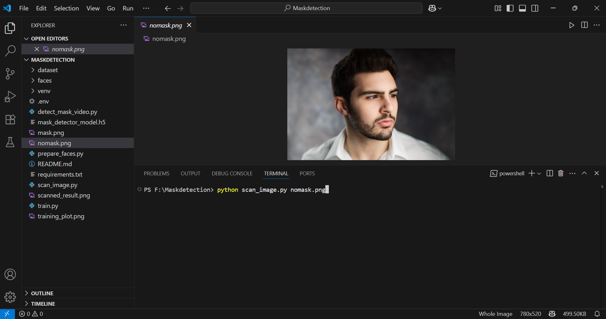
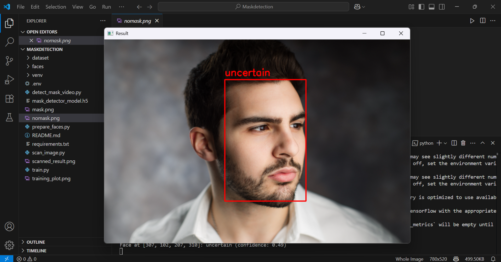
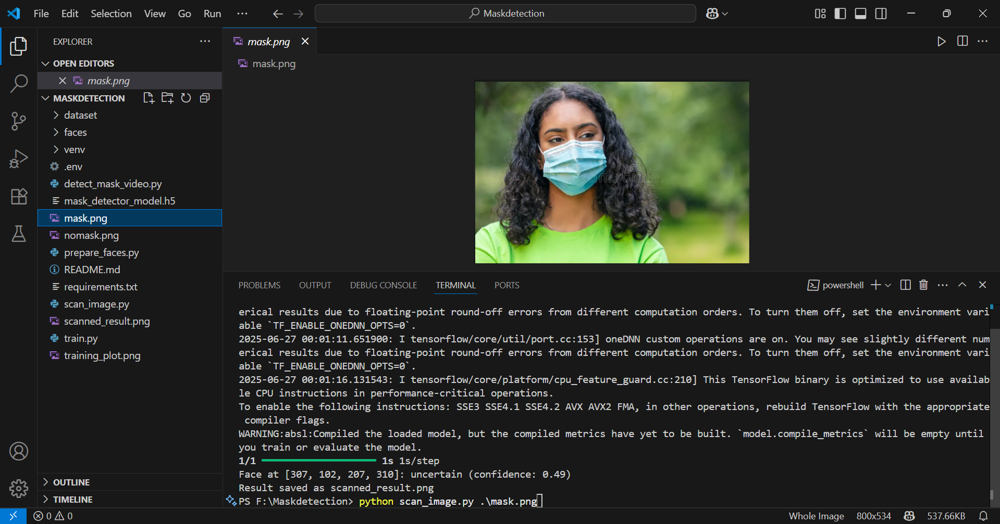
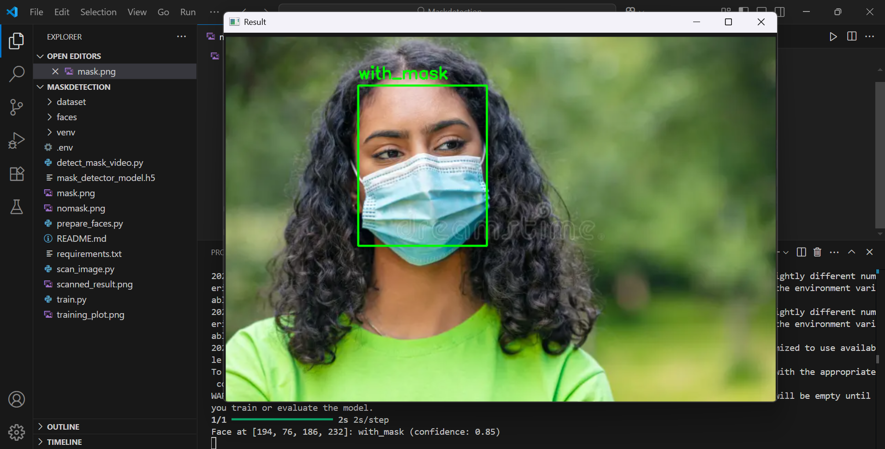

## 😷 Face Mask Detection System


[](https://www.python.org/)
[](https://www.tensorflow.org/)
[](https://keras.io/)
[]()

A real-time face mask detection system that combines **MTCNN** for face detection with **MobileNetV2** for mask classification, built using modern deep learning frameworks.


## 📌 Overview
This system detects face masks using a combination of:

1. **MTCNN for face detection**

2. **MobileNetV2 for mask classification (3 classes)**

3. **Keras/TensorFlow for model training and inference**

It supports:

- Static image analysis

- Real-time webcam detection

- Training your own model with a labeled dataset

XML-based dataset parsing for face crops

## 📁 Project Structure
```

├── prepare_faces.py           # Prepares face images from XML annotations
├── train.py                    # Trains the MobileNetV2 mask classifier
├── scan_image.py               # Runs detection on a given image
├── detectmaskedvideo.py       # Real-time mask detection via webcam
├── requirements.txt            # All dependencies for the project
└── scanned_result.png          # Output image (after running scan_image.py)
```


## 🔧 Installation
First, make sure Python 3.7+ is installed.


1. **Clone the repository**

git clone https://github.com/SHIVAMrajak098/mask-detection.git
cd mask-detection

2. **Install dependencies**

pip install -r requirements.txt

3.**📦 Download Dataset**


Manually download the dataset from Kaggle:

👉 https://www.kaggle.com/datasets/andrewmvd/face-mask-detection

**Steps:**
- Sign in to Kaggle and open the link.

- Click "Download" to get the ZIP file.

- Extract it into a folder called dataset/ inside your project root.


## 🧼 Data Preprocessing (prepare_faces.py)
Before training, the dataset needs to be cleaned and prepared.
The raw Kaggle Face Mask Detection dataset provides Pascal VOC-style XML annotations that describe bounding boxes for different mask categories.

We use the script prepared_faces.py to:

🔍 Parse each XML annotation file

🖼️ Crop the face regions from the original images based on bounding box coordinates

📁 Organize and save them into class-wise folders inside the faces/ directory:

```
faces/
├── with_mask/
├── without_mask/
└── mask_weared_incorrect/
```

**RUN** ``` python prepare_faces.py```

## Train the Model
Train the MobileNetV2-based mask detector:
```bash
python train.py
```
- The trained model will be saved as `mask_detector_model.h5`.
- A training plot will be saved as `training_plot.png`.


## Real-Time Mask Detection
Run the real-time detection script:
```bash
python detect_mask_video.py
```
- A webcam window will open.
- Detected faces will be labeled as `with_mask`, `without_mask`, or `mask_weared_incorrect`.
- Press `q` to quit.


## 🖼️ Run on Image

Run the script to scan images

```python scan_image.py path/to/image.jpg```

- Detects faces and classifies them

- Saves result as scanned_result.png

  ## 📸 Screenshot Examples

### Face Scanning Without Mask
<div style="display: flex; gap: 20px; flex-wrap: wrap; margin-bottom: 30px;">
  
  
</div>

### Face Scanning With Mask
<div style="display: flex; gap: 20px; flex-wrap: wrap;">
  
  
</div>

Detection Confidence Legend:
- 🔴 Red border: No mask detected (confidence > 90%)
- 🟢 Green border: Mask detected (confidence > 85%)
- ⚠️ Yellow border: Uncertain prediction (confidence 70-85%)


## 🔍 Classes Detected
✅ with_mask

❌ without_mask

⚠️ mask_weared_incorrect

uncertain (low confidence)

## Notes
- Make sure your webcam is connected and accessible.
- You can adjust parameters (batch size, epochs, etc.) in `train.py` as needed.
- The class labels in `detect_mask_video.py` should match your dataset's folder names.


## 🙋‍♂️ Author & Contact

> Developed with 💻 and ☕ by **[Shivam Rajak](https://github.com/SHIVAMrajak098)**

## 🙋 Contact

Made with ❤️ by **Shivam Rajak**

- 📧 Email: [shivamrajak.098@gmail.com](mailto:shivamrajak.098@gmail.com)  
- 🔗 LinkedIn: [linkedin.com/in/shivam-rajak-3177102b8](https://www.linkedin.com/in/shivam-rajak-3177102b8)  
- 🧠 GitHub: [github.com/SHIVAMrajak098](https://github.com/SHIVAMrajak098)


## Credits
- [Kaggle Face Mask Detection Dataset](https://www.kaggle.com/datasets/andrewmvd/face-mask-detection)
- TensorFlow, Keras, OpenCV 

